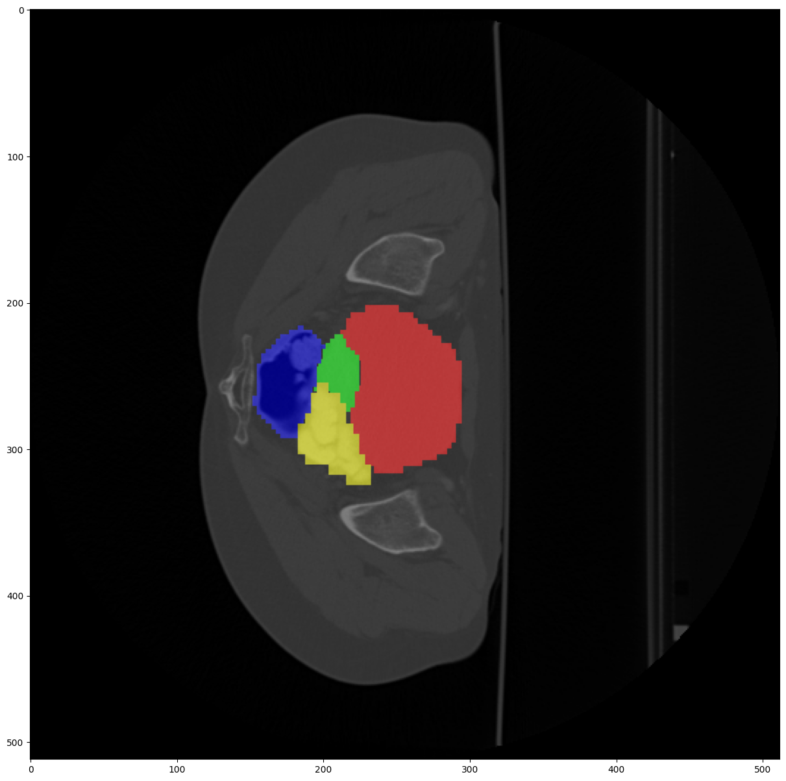

<h1>Week One: 26 April - 3 May</h1>

## 1. Labeling software for semantic segmentation

### 1.1. Label Studio
Advantages:
- Free
- Browser based (able to install via `pip`)

Disadvantages:
- Interpolates output masks (it is not bitwise): preprocessing required

### 1.2. LabKit (plugin from imageJ / fiji)
Advantages:
- Free
- Available for windows, macOS, linux
- Very good UI for drawing
- Has traditional ML for segmentation, as a starting point

Disadvantages:
- Need to work image by image and export annotations class by class

### 1.3. QuPath
*Software for Bioimage Analysis*

Advantages:
- Free
- Available for windows, macOS, linux
- Good UI

Disadvantages:
- Exporting the annotations is challenging (scripting is required)

### 1.4. LabelBox

### 1.5. MIPAV

## 2. Datasets from other disciplines

### Medical
1. **<a href="https://www.synapse.org/#!Synapse:syn3193805/wiki/217789" target="_blank">Synapse multi-organ</a>**

    Benchmark dataset used in swin-unet & trans-unet
    
    Abdomen set:
        

    Cervix set:
    

2. **<a href="https://humanheart-project.creatis.insa-lyon.fr/database/#collection/637218c173e9f0047faa00fb/folder/637218e573e9f0047faa00fc" target="_blank">ACDC</a>**

    Benchmark dataset used in swin-unet & trans-unet

    
    
3. **<a href="https://downloads.imagej.net/ISBI-2012-challenge.zip" target="_blank">ssTEM-VNC</a>**

    Benchmark dataset used in the original unet

    

| Dataset | # Classes | Dimensions | # Samples | Labeled | Remarks
|---------|:---------:|---------|---------|---------|---------|
| Synapse abdomen | 13 |512 $\times$ 512 $\times$ volume|30/20| Yes |No test label, volume $\approx$ 150|
| Synapse cervix | 4 |512 $\times$ 512 $\times$ volume|30/20| Yes |No test label, volume $\approx$ 100|
| ACDC |3|256 $\times$ 256 $\times$ volume|100/50| Yes ||
| ssTem-VNC | 2 |512 $\times$ 512|30/30| Yes ||

## 3. Multiple Level Tracking (MLT-4) toolkit
