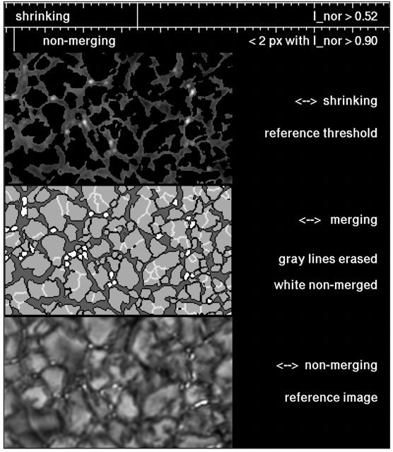

<h1>Week One: 26 April - 3 May</h1>

## 1. Labeling software for semantic segmentation

### 1.1. <a href="https://labelstud.io" target="_blank">Label Studio</a>
Advantages:
- Free
- Browser based (able to install via `pip`)

Disadvantages:
- Interpolates output masks (it is not bitwise, has weak edges): preprocessing required

  

  

### 1.2. <a href="https://qupath.github.io" target="_blank">QuPath</a>
*Software for Bioimage Analysis*

Advantages:
- Free
- Available for windows, macOS, linux
- Good UI

Disadvantages:
- Exporting the annotations is challenging (scripting is required)

  

  

### 1.3. <a href="https://mipav.cit.nih.gov" target="_blank">MIPAV</a>
From NIH for medical image analysis

Advantages:
- Free
- Widely used in research
- Lots of analysis tools and algorithms

Disadvantages:
- Not so user-friendly interface

### 1.4. <a href="https://imagej.net/software/fiji/downloads" target="_blank">LabKit (plugin from imageJ / Fiji)</a>
Advantages:
- Free
- Available for windows, macOS, linux
- Very good UI for drawing
- Has traditional ML for segmentation, as a starting point

Disadvantages:
- Need to work image by image and export annotations class by class

  

### 1.5. Kaibu
*Found later*, web-based, easy to use.
https://kaibu.org/

### 1.6. MATLAB
*Found later*.

## 2. Datasets from other disciplines

### Medical
1. **<a href="https://www.synapse.org/#!Synapse:syn3193805/wiki/217789" target="_blank">Synapse multi-organ</a>**

    Benchmark dataset used in swin-unet & trans-unet
    
    Abdomen set:

        

    Cervix set:

    

2. **<a href="https://humanheart-project.creatis.insa-lyon.fr/database/#collection/637218c173e9f0047faa00fb/folder/637218e573e9f0047faa00fc" target="_blank">ACDC</a>**

    Benchmark dataset used in swin-unet & trans-unet

    
    
3. **<a href="https://downloads.imagej.net/ISBI-2012-challenge.zip" target="_blank">ssTEM-VNC</a>**

    Benchmark dataset used in the original unet

    Nerve cells of flies

    

*More datasets available at <a href="https://arxiv.org/abs/2009.13120" target="_blank">Medical Image Segmentation Using Deep Learning: A Survey</a> paper, page 18.*

| Dataset | # Classes | Dimensions | # Samples | Labeled | Remarks
|---------|:---------:|---------|---------|---------|---------|
| Synapse abdomen | 13 |512 × 512 × volume|30/20| Yes |No test label, volume ≈ 150|
| Synapse cervix | 4 |512 × 512 × volume|30/20| Yes |No test label, volume ≈ 100|
| ACDC |3|256 × 256 × volume|100/50| Yes |volume ≈ 20|
| ssTem-VNC | 2 |512 × 512|30/30| Yes ||

## 3. Multiple Level Tracking (MLT-4) toolkit
Bovelet et. al have published their tool <a href="https://wwwuser.gwdg.de/~astronom/" target="_blank">online</a>. This is the 2007 new version, written in IDL (Interactive Data Language) executable in PV-WAVE or IDL (not free).

Alternative: <a href="https://github.com/gnudatalanguage/gdl" target="_blank">GDL (GNU Data Language)</a> which is open-source.

There are lots of arguments, such as thresholds, etc. which need to be defined.

## Other notes
The DKIST data has R domain, and cannot be visualized in raw format. Needs normalization to [0, 1], and thus possible loss of information for the labeling stage (but not the segmentation task).