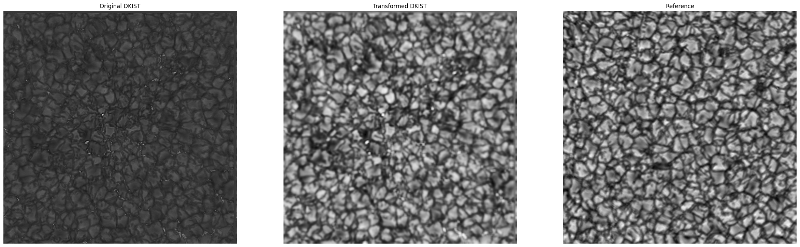

<h1>Week Ten: 25 June - 2 July</h1>

## Pre-labeling DKIST with Frontiers' best model
### 1. Concatenating all ImaX/Sunrise rasters

### 2. Resizing DKIST instance from 4096 x 4096 to 768 x 768
### 3. Getting sharpness of 1
### 4. Applying blurring to DKIST instance to match the sharpness in 3
### 5. Histogram matching (adjustment of brightness/contrast)

### 6. Getting the predicted mask for DKIST instance

### 7. Resizing mask from 6 from 768 x 768 to 4096 x 4096