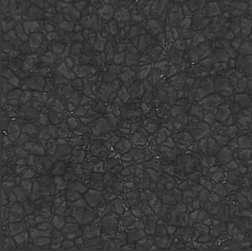
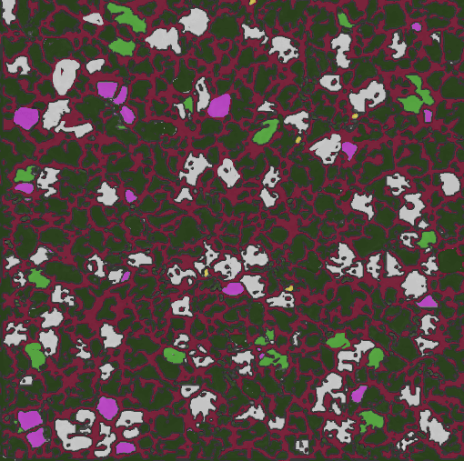

<h1>Week 12/13/14/15: 9 July - 6 August</h1>

## Labeling DKIST

- 200 images with 6 second intervals: 20 minutes from Kevin
    - Thus, not too diverse (in terms of pattern)
    - Too diverse (in terms of intensity)

- 10 selected rasters of 4096 x 4096
    - Diverse (in terms of pattern)
    - Not diverse (in terms of intensity)

- Labeling 80% finalized

        
        

- SABID deadline 1 Oct. 2024

