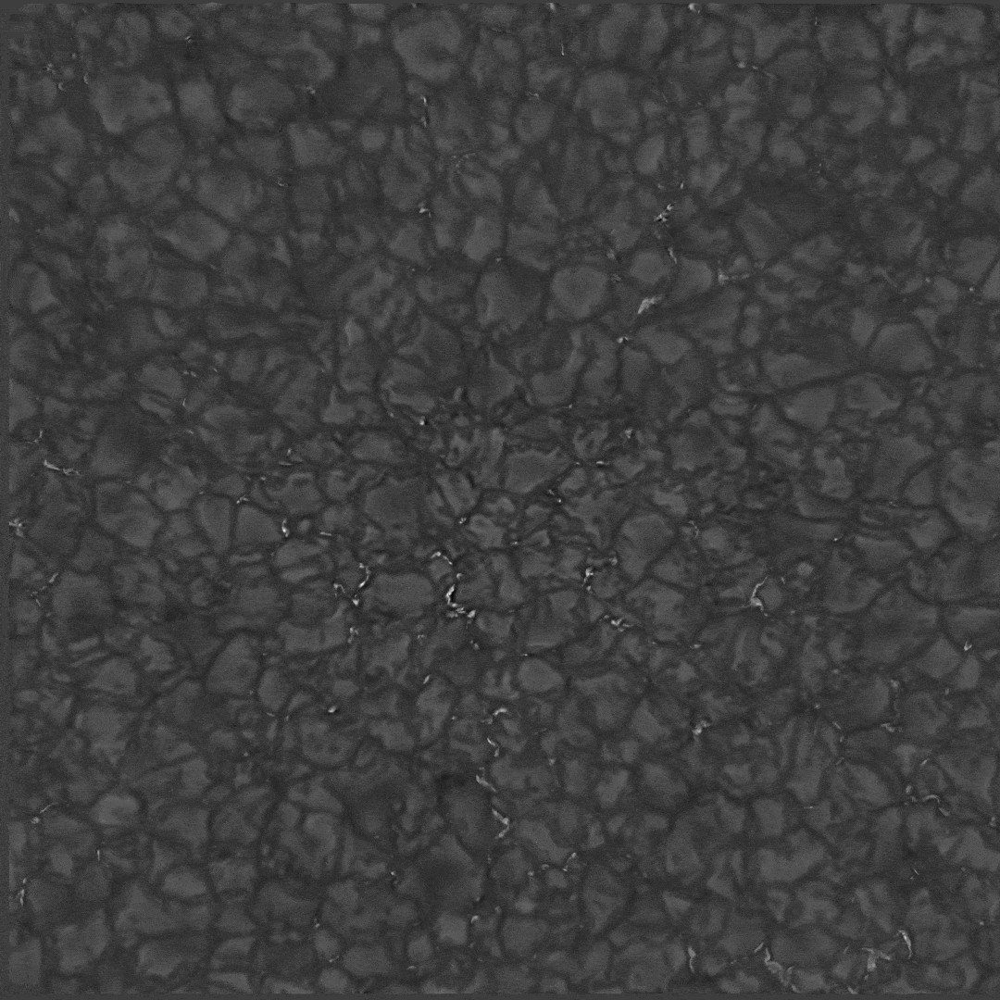
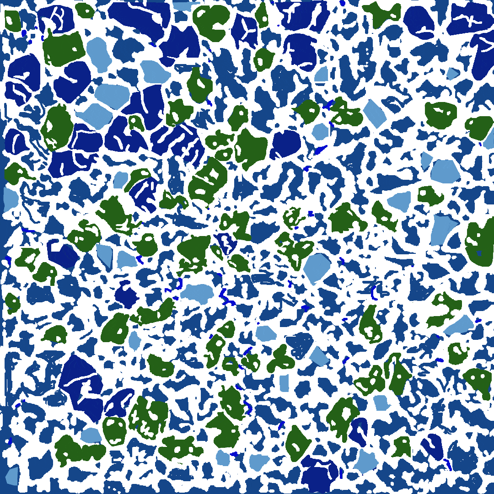
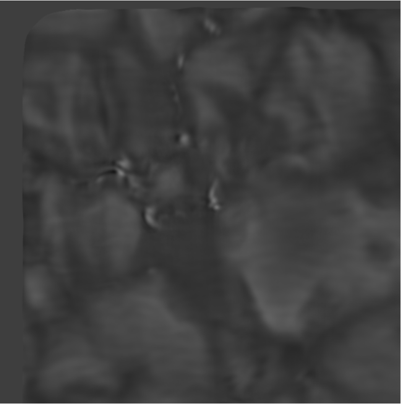

<h1>Week 16: 6 August - 13 August</h1>

## Labeling DKIST

        
        

- Originally 4096 x 4096 images
- ImaX/Sunrise is 768 x 768
- Taking advantage of high resolution aspect (no resizing)

### Problem:

- There are frame-like pixels </img>

- 96 pixels max

### Solution:

- Cropping them out (with powers of 2 in mind)

- Frontiers' did 128 x 128 (36) predictions from 768 x 768

- We'll do 512 x 512 to contain the biggest granules

- 4096 x 4096 -> central 3584 x 3584 (49 predictions per image)

- Will follow the same augmentation procedure as Frontiers'