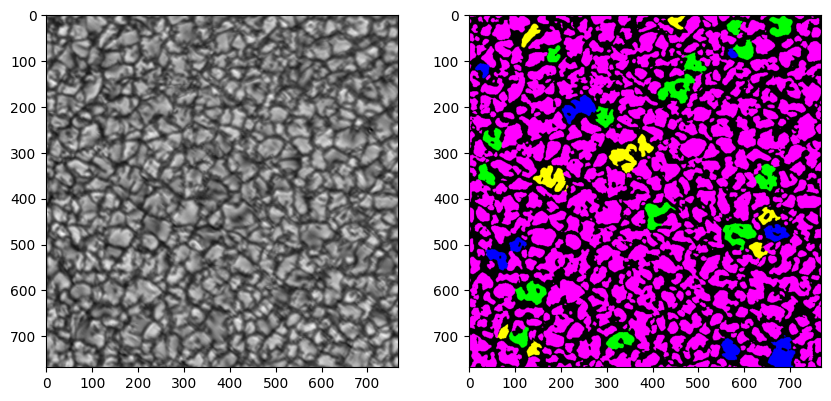

<h1>Week Two: 3 May - 7 May</h1>

## 1. Solar datasets

### 1. ImaX/Sunrise
- 5 classes
- Ground truth available
- Eight 768 x 768 frames
- Data from <a href="https://www.frontiersin.org/articles/10.3389/fspas.2022.896632/full" target="_blank">frontiers paper</a> available <a href="https://gitlab.leibniz-kis.de/smdiazcas/SegGranules_Unet_model" target="_blank">here</a>

## 2. Toolkits for semantic segmentation

### 1. State-of-the-art UNet in pytorch
- Code from <a href="https://www.frontiersin.org/articles/10.3389/fspas.2022.896632/full" target="_blank">frontiers paper</a> available <a href="https://gitlab.leibniz-kis.de/smdiazcas/SegGranules_Unet_model" target="_blank">here</a>
- Code from `segmentation-models-pytorch` <a href="https://github.com/qubvel/segmentation_models.pytorch">python package</a>

### 2. UNet++ in pytorch
- Code from `segmentation-models-pytorch` <a href="https://github.com/qubvel/segmentation_models.pytorch">python package</a>

### 3. TransUnet in pytorch
- Code from the <a href="https://arxiv.org/pdf/2102.04306.pdf" target="_blank">original paper</a> available  <a href="https://github.com/Beckschen/TransUNet?tab=readme-ov-file" target="_blank">here</a>

### 4. SegNet
- Code from the <a href="https://arxiv.org/abs/1511.00561" target="_blank"> original paper</a> available <a href="https://github.com/alexgkendall/caffe-segnet" target="_blank">here</a> (in Caffe framework)

- <a href="https://github.com/vinceecws/SegNet_PyTorch" target="_blank">Implementation in pytorch</a>

- Implementation from scratch in pytorch exlpained <a href="https://medium.com/@nikdenof/segnet-from-scratch-using-pytorch-3fe9b4527239" target="_blank">here</a>

### 5. Swin-UNet in pytorch
- Code from the <a href="https://arxiv.org/abs/2105.05537" target="_blank">original paper</a> available  <a href="https://github.com/HuCaoFighting/Swin-Unet/tree/main" target="_blank">here</a>