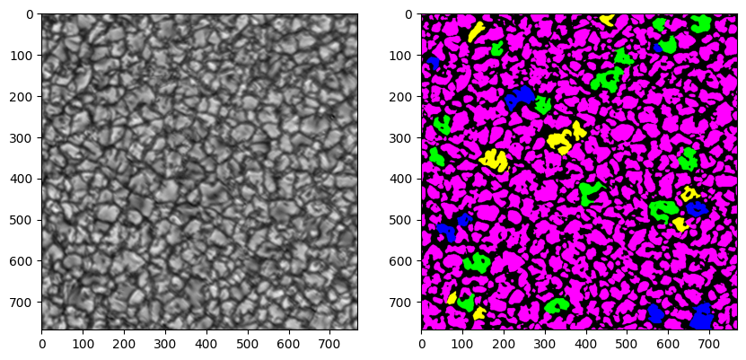

<h1>Week Two: 3 May - 7 May</h1>

## 1. Solar datasets

### 1. ImaX/Sunrise
- Eight 768 x 768 frames
- Ground truth available
- Code / data from <a href="https://www.frontiersin.org/articles/10.3389/fspas.2022.896632/full" target="_blank">frontiers paper</a> available <a href="https://gitlab.leibniz-kis.de/smdiazcas/SegGranules_Unet_model" target="_blank">here</a>

```python
import cv2
import numpy as np
import matplotlib.pyplot as plt
```


```python
frame = np.load('Mask_data_Frame_0.npz')
x = frame['smap']
gt = frame['cmask_map']
print('shapes:', x.shape, gt.shape)
print('classes:', np.unique(gt))
```

    shapes: (768, 768) (768, 768)
    classes: [0 1 2 3 4]


```python
colors = [
    (0, 0, 0),
    (0, 255, 0),   # Class 1: Green
    (0, 0, 255),   # Class 2: Blue
    (255, 255, 0), # Class 3: Yellow
    (255, 0, 255), # Class 4: Magenta
]
```


```python
mask = np.zeros((*x.shape, 3), dtype=np.uint8)
for class_index in range(5):
    mask[gt == class_index] = colors[class_index]

plt.figure(figsize=(10, 10))
plt.subplot(1, 2, 1)
plt.imshow(x, cmap='gray')
plt.subplot(1, 2, 2)
plt.imshow(mask)
plt.show()
```


    


## 2. Toolkits for semantic segmentation