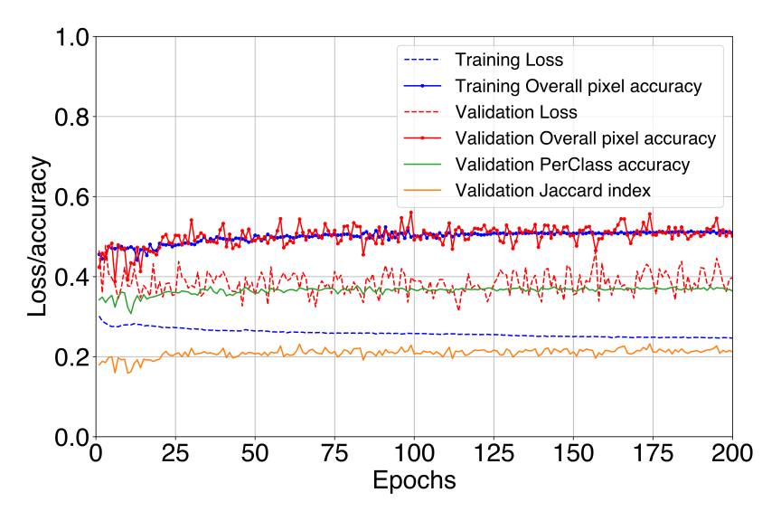

<h1>Week Three: 7 May - 14 May</h1>

# 1. New data
- https://www.kaggle.com/datasets/peterwarren/voronoi-artificial-grains-gen/data

- https://datasetninja.com/annotated-quantitative-phase-microscopy-cell-dataset

- https://datasetninja.com/malaria-segmentation

- https://datasetninja.com/ccagt

- paper: https://www.sciencedirect.com/science/article/pii/S104458032100108X data: https://data.mendeley.com/datasets/t4wvpy29fz/2

# 2. Experiments
## 2.1. ImaX/Sunrise
