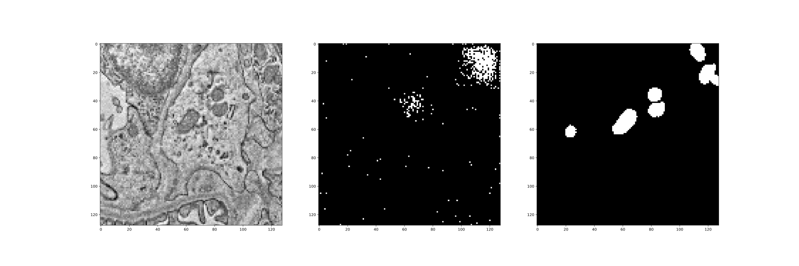

<h1>Week Three: 7 May - 14 May</h1>

# 1. New data
## 1.1. <a href="https://www.kaggle.com/datasets/peterwarren/voronoi-artificial-grains-gen/data" target="_blank">ExON Steel Grains</a>
- A Kaggle dataset (not benchmarked)
- 480 Images
- 400 x 400
- 2 classes: Foreground and background
- Ground truth available

## 1.2. <a href="https://datasetninja.com/malaria-segmentation" target="_blank">Malaria</a>
- 3572 Images
- 1382 x 1030
- 9 classes
- Ground truth available

# 2. Experiments
## 2.1. ImaX/Sunrise
### 2.1.1. SegNet
#### 2.1.1.1. Focal loss function

#### 2.1.1.2. Cross entropy loss function

### 2.1.2. UNet
#### 2.1.2.1. Focal loss function

#### 2.1.2.2. mIoU loss function

## 2.2. Steel grains
### SegNet - Cross entropy loss

## 2.3. MitoLab
### SegNet - Cross entropy loss

