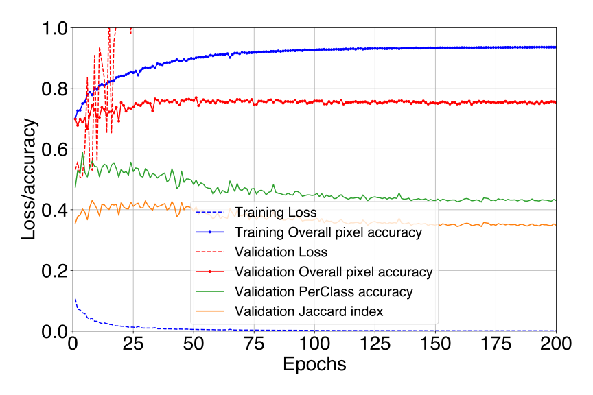
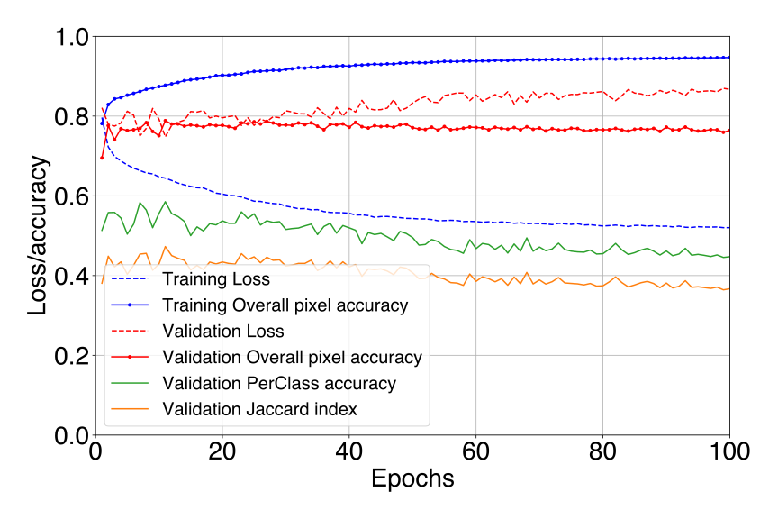
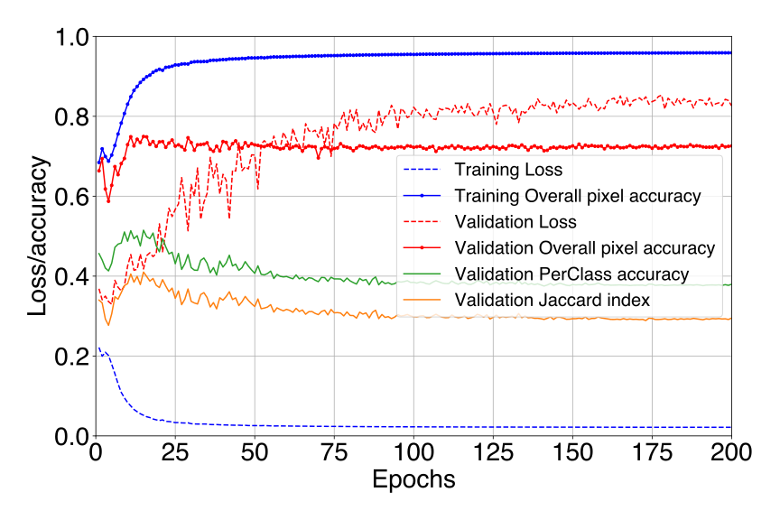
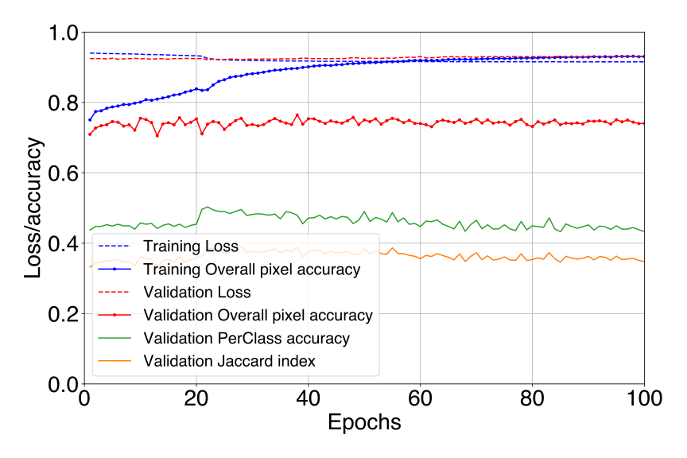

# class imbalance refs

https://doi.org/10.1109/IJCNN.2008.4633969

https://doi.org/10.1007/978-3-319-98074-4_2

https://doi.org/10.1109/TKDE.2008.239

He, H., and Ma, Y. (2013). Imbalanced Learning: Foundations, Algorithms, and Applications. 1st edn. Hoboken

https://doi.org/10.1109/cvpr.2016.580

https://doi.org/10.1109/TNNLS.2017.2732482

https://doi.org/10.1109/TPAMI.2020.2981890

https://doi.org/10.1016/j.media.2016.05.004

https://doi.org/10.1016/j.jag.2022.102690

https://doi.org/10.3390/rs13163220

# ImaX/Sunrise class distribution

# Reproducing frontiers' results
## UNet
### Focal loss

### mIoU

## SegNet
### Focal loss

### mIoU

