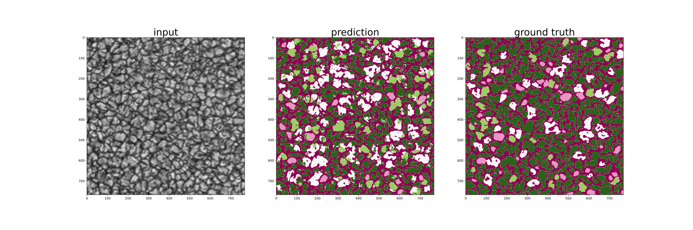
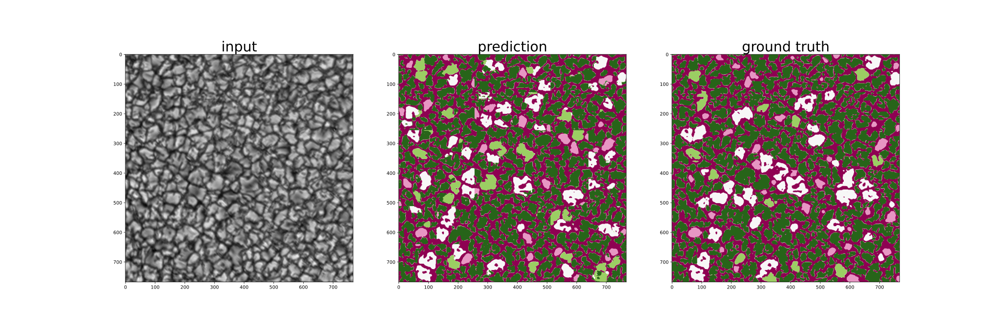

<h1>Week Four: 14 May - 21 May</h1>

## Class imbalance problem
### State-of-the art methods in general:
-   Balancing the data
    -   Sampling strategies
        -   Cons:
            - Oversampling: computation cost
            - Undersampling: loss of information
    -   Synthetic generation
-   Cost-sensetive learning
    -   A cost matrix is introduced (static/dynamic)

    
    
    -   Loss function is adjusted/weighted

    
    -   Can be utilized in 4 ways:
        - Applied to the probabilistic estimate
        - Outputs themselves can be made cost-sensitive
        - Applied to learning rate
        - Error minimization function can be adapted to account for expected costs

<a href="https://doi.org/10.1109/TKDE.2008.239" target="_blank">Reference</a>

### Two-phase training:
1. Train on equiprobable classes
2. Fine-tune (i.e., low-level feature layers at the top) on hard classes

<a href="https://doi.org/10.1016/j.media.2016.05.004" target="_blank">Reference</a>

### Loss functions:

1.  Cross entropy
2.  Weighted cross entropy
3.  Focal
4.  **Weighted focal**
5. Lovaz-softmax <a href="https://openaccess.thecvf.com/content_cvpr_2018/papers/Berman_The_LovaSz-Softmax_Loss_CVPR_2018_paper.pdf" target="_blank">Paper</a>, <a href="https://github.com/bermanmaxim/LovaszSoftmax" target="_blank">Code</a>

## ImaX/Sunrise class distribution

## Reproducing frontiers' results
### UNet
#### Focal loss

#### mIoU

### SegNet
#### Focal loss

#### mIoU

## All references

https://doi.org/10.1109/IJCNN.2008.4633969

https://doi.org/10.1007/978-3-319-98074-4_2

https://doi.org/10.1109/TKDE.2008.239

https://doi.org/10.1109/cvpr.2016.580

https://doi.org/10.1109/TNNLS.2017.2732482

https://doi.org/10.1109/TPAMI.2020.2981890

https://doi.org/10.1016/j.media.2016.05.004

https://doi.org/10.1016/j.jag.2022.102690

https://doi.org/10.3390/rs13163220

https://doi.org/10.1109/ICCV.2017.324

https://doi.org/10.6094/UNIFR/150065