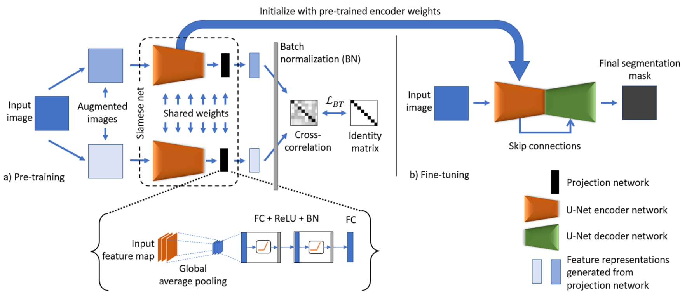
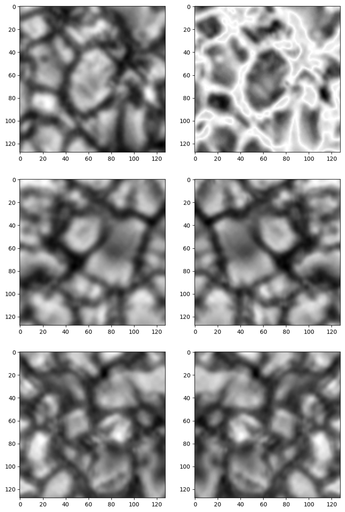
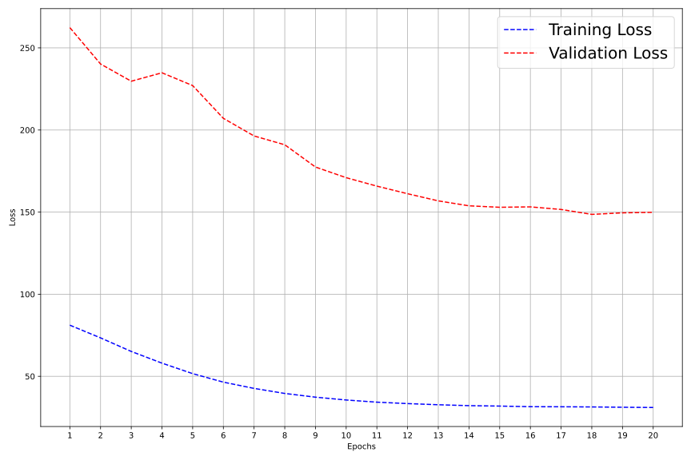
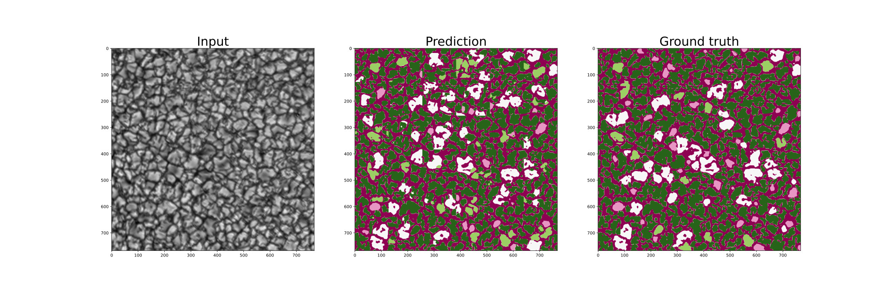
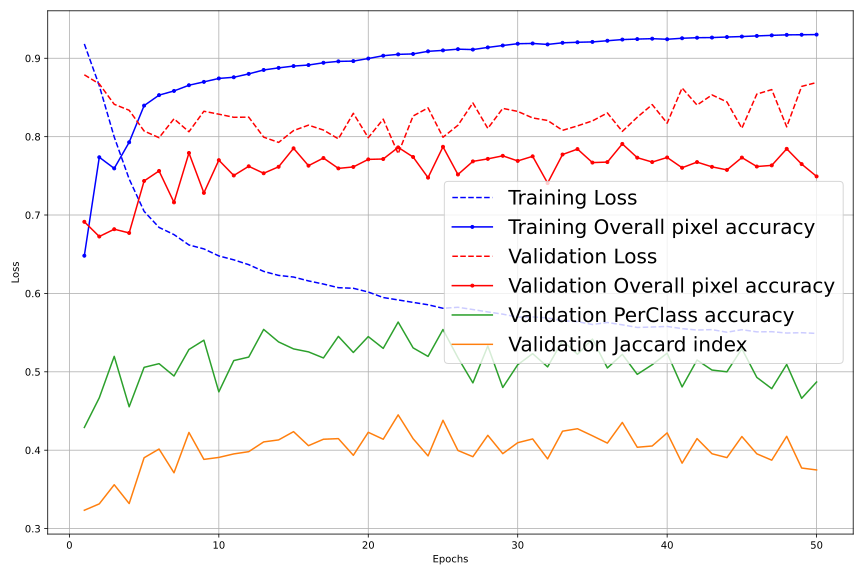

<h1>Week Nine: 18 June - 25 June</h1>

## BT-UNet Framework
[Paper](https://arxiv.org/abs/2112.03916) - [Implementation in tensorflow](https://github.com/nspunn1993/BT-Unet)

My [implementation](https://github.com/rezmansouri/dkist-seg/tree/main/src/experiments/imax_sunrise_bt_unet) in PyTorch (Required for faster progress)

### Experiment details on ImaX/Sunrise

- UNet with 1/4 of parameters (simpler model, less overfitting)
- Pretraining (The encoder):
    - Dropout after levels 2, 3, and 4
    - Augmentations: Random horizontal flip, saturation, blurring
    
    - Batch size: 64
    - Train/val split: 27,000 - 3,000
    - 20 epochs
    - Reducing learning rate by x 0.9 after 5 consecutive failed imporvement on validation set

- Training (Encoder: fine-tuned, decoder: trained from scratch)
    - No dropout
    - Loss function: mean IoU
    - Batch size of 512
    - Train/val split: 27,000 - 3,000
    - 50 epochs
    - Reducing learning rate by x 0.9 after 5 consecutive failed imporvement on validation set

## Misc.
I gained access to the Complete  [IMaX/Sunrise](https://star.mps.mpg.de/sunrise/?page_id=19) unlabeled data.